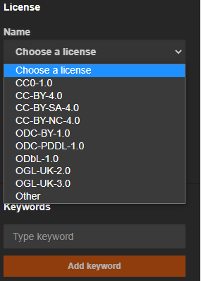
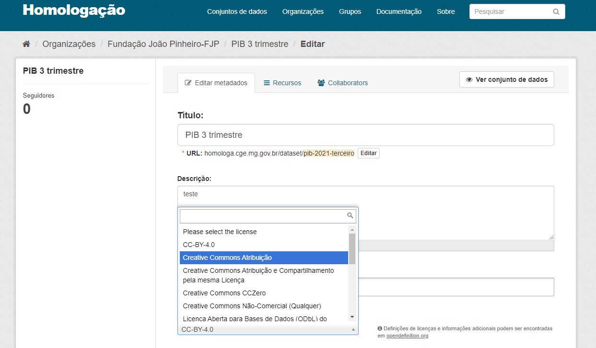

# Licenças em dados abertos: background e representação

## Background

O campo de licenças é um metadado obrigatório:

- para o Portal Federal de Dados Abertos, regulamentado no [Decreto Federal 8777](https://www.planalto.gov.br/CCIVIL_03/_Ato2015-2018/2016/Decreto/D8777.htm#art2) e na [resolução CGINDA 2 de 2017](https://wiki-dados.cgu.gov.br/GetFile.aspx?File=%2fComiteGestor%2fResolu%c3%a7%c3%b5es%2fresolucao-cginda-2-24-3-2017%2cpdf.pdf)(ver 'Condições de uso dos dados disponibilizados', pág. 2/4):

> Os dados e as informações publicados no Portal Brasileiro de Dados Abertos estão disponíveis
> conforme as condições definidas neste documento, devendo o usuário verificar, no metadado
> correspondente a cada conjunto de dados, as licenças sobre condições adicionais, que podem
> ser atualizadas, corrigidas e/ou substituídas a qualquer tempo.
> Antes da realização da escolha da licença mais adequada, deverá ser levado em consideração
> se o dado possui direito autoral ou não.A base de dados deverá ser identificada como sendo
> de domínio público nos seguintes casos: aquelas que, por critério de seleção, organização ou
> disposição de seu conteúdo, não puderem ser consideradas criações intelectuais e os
> cadastros e os atos oficiais que não gozam de proteção de direitos autorais.
> Caso contrário, seu direito autoral existe e pertence à Administração, de maneira que cada
> instituição deverá escolher uma licença que configure a base de dados como sendo dados
> abertos, tais como: Creative Commons Zero, Public Domain Dedication and License (PDDL),
> Creative Commons Atribuição 4.0 e Open Database License (OdbL).


- nas [especificações da Frictionless Data](https://specs.frictionlessdata.io/data-package/#licenses) e no [datapackage creator da Frictionless](https://create.frictionlessdata.io/) - ferramenta derivada das _Frictionless Specs_, que contém uma lista predefinidas de possíveis licenças;



- está sendo incluído como item nas especificações das nossas necessidades com a Stefanini: [issue descritivo](https://github.com/transparencia-mg/work-stefanini/issues/69);

- e será incluído como metadado obrigatório no [Manual de Dados Abertos de MG](https://transparencia-mg.github.io/manual-abertura/pages/002_metadados.html#metadados-obrigat%C3%B3rios-e-facultativos-no-portal-de-dados-abertos-de-minas-gerais).

A discussão interna que fundamenta a escolha do tipo de licença está [neste card](https://trello.com/c/OQVjhGeM/877-escolher-licen%C3%A7a-aberta-para-dados-de-interesse-coletivo-e-geral), que foi originado da demanda registrada [nesse outro card](https://trello.com/c/auyl56pH/91-licenciamento-de-uso-de-dados-3-artefatos).

## Representação

Como utilizamos as especificações da Frictionless para documentar nossos conjuntos, os valores e hiperlinks da licença que [convencionamos utilizar no ano passado](https://trello.com/c/OQVjhGeM/877-escolher-licen%C3%A7a-aberta-para-dados-de-interesse-coletivo-e-geral#comment-610ab3589a7b7e1ec9a1c564) são representados pelos valores da lista de dicionários conforme abaixo:

````
  "licenses": [
    {
      "name": "CC-BY-SA-4.0",
      "title": "Creative Commons Attribution Share-Alike 4.0",
      "path": "https://creativecommons.org/licenses/by-sa/4.0/"
    }
  ]
````
Entretanto, o `datapackage.json` é lido como um recurso qualquer no CKAN, como se fosse um arquivo de dados, e nem todas os valores das propriedades nele descritas encontram correspondência (vide questões de trasnposição 'de-para' nos [issues sobre a extensão ckanext-scheming](https://github.com/ckan/ckanext-scheming/issues) 

Assim, o hiperlink da versão 4.0 da licença CC-BY não está aparecendo na GUI (interface gráfica do usuário) do CKAN:


Uma maneira transitória é fazer a atribuição da licença via GUI, para fazer demonstrar o hiperlink de forma correta e possibilitar ao usuário acessar a página que descreve as prerrogativas da licença:




Entretanto, qualquer atualização via CLI (linha de comando) ou dataset-template do conjunto de dados no github vai sobrescrever a atribuição do hiperlink da licença via GUI e retornar somente o texto sem hiperlink, contendo o nome da licença atribuída para aquele conjunto.

A solução definitiva para esse caso, dentre outros de falta de correspondência entre os metadados padrão Fricionless e padrão CKAN, seria a adoção de extensões que fazem esse trabalho, como estamos estudando em [Frictionless CKAN Mapper](https://github.com/frictionlessdata/frictionless-ckan-mapper).

## Contexto Atual

Porém, uma característica da versão 2.10-dev (a mais atual no momento) do CKAN é a de que as licenças possuem uma listagem codificada diretamente no **código-fonte**, o que limita adaptações via instalações de extensões. Ao longo do trabalho com Stefanini, e após o release da nova versão do CKAN, clarificaremos este cenário de como aplicar as licenças da maneira mais prática possível, do ponto de vista do publicador, sem perder de vista a prerrogativa de reúso de 'dado aberto' que gostaríamos de preservar, como administradores de sistema. 

Nesse sentido, gostaríamos de estabelecer dois tipos básicos de licenças para todo e qualquer tipo de conjutno aberto no dados.mg.gov.br:

- domínio público

- atribuição

Esse entendimento encontra respaldo na comunidade, já visto em cursos anteriores sobre o CKAN, ministrado pela OKFBr, e estudado pelo Augusto Hermann [^1] [neste post](https://herrmann.tech/pt/blog/2020/12/07/dados-abertos-a-retrospectiva-de-um-comite.html) como uma questão de atribuição escalar das licenças - podendo ser proposta, em âmbito estadual, por uma Resolução da CGE (como já rascunhado nos cards internos supracitados), ou elemento de um Decreto que verse sobre a Política de Dados Abertos. 

[^1]: Um dos criadores e desenvolvedores do Portal Federal de Dados Abertos