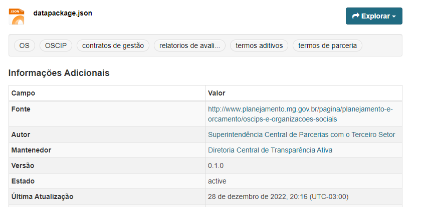

# Metadados de identificação de responsáveis pelos conjuntos de dados: background e representação

## Contexto

Informações sobre os nomes e pontos de contatos de autores e responsásveis pelos conjuntos de dados publicados são essenciais para promover responsabilização e assessibilidade. Em eventuais dúvidas ou pedidos de contato, por exemplo, teremos de reencaminhar demandas via mecanismos de transparência passiva (i.e. que chegarem até nós pelo fale conosco, por issues ou pull requests, ou no email) para os contatos dos custodiantes responsáveis pelos dados. O formulário de solicitação de cadastro de usuário no PdA possui campos para colhermos o nome do servidor responsável pela publicação e os seus emails pessoal e do setor.

## Background

As informações sobre autores e responsáveis pelos dados publicados são metadados mencionados:

- no [Portal Federal de Dados Abertos](https://dados.gov.br/pagina/manuais-e-orientacoes);

- no [Modelo de Referência de Abertura de Dados](https://www.gov.br/cgu/pt-br/governo-aberto/a-ogp/planos-de-acao/4o-plano-de-acao-brasileiro/compromisso-2-docs/modelo-de-referencia-de-abertura-de-dados_versao-final-2.pdf)(vide página 31/99)

- nas [especificações da Frictionless Data](https://specs.frictionlessdata.io/data-package/#contributors):

```` "contributors": [{
  "title": "Joe Bloggs",
  "email": "joe@bloggs.com",
  "path": "http://www.bloggs.com",
  "role": "author"
}]
````

- está sendo incluído como item nas especificações das nossas necessidades com a Stefanini: [ver critério 007](https://transparencia-mg.github.io/work-stefanini/0.6/estorias_de_usuarios/sprint_04/06_edicao_do_conjunto_de_dados/#criterios-de-aceite);

- e será incluído como metadado obrigatório no [Manual de Dados Abertos de MG](https://transparencia-mg.github.io/manual-abertura/pages/002_metadados.html#metadados-obrigat%C3%B3rios-e-facultativos-no-portal-de-dados-abertos-de-minas-gerais).

A discussão interna que fundamenta a obrigatoriedade desse metadado encontra-se [neste issue](https://github.com/transparencia-mg/issues-dadosmg-legado/issues/68).

## Representação

Como utilizamos as especificações da Frictionless para documentar nossos conjuntos, os campos de nome e email dos autores, publicadores e mantenedores são representados pelos valores da lista de dicionários conforme abaixo:

````
  "contributors": [
    {
      "title": "Superintendência Central de Parcerias com o Terceiro Setor",
      "role": "author",
      "email": "oscip@planejamento.mg.gov.br"
    },
    {
      "title": "Diretoria Central de Transparência Ativa",
      "role": "maintainer",
      "email": "transparencia@cge.mg.gov.br"
    }
  ]
````
Entretanto, o `datapackage.json` é lido como um recurso qualquer no CKAN, como se fosse um arquivo de dados, e nem todas os valores das propriedades nele descritas encontram correspondência (vide questões de trasnposição 'de-para' nos [issues sobre a extensão ckanext-scheming](https://github.com/ckan/ckanext-scheming/issues) .

Assim, informações sobre `publisher` não são interpretadas pelos campos do CKAN, apenas autor e mantenedor, que têm os nomes/valores das propriedades `title` funcionando como hiperlinks para acessar o `email` informado via `datapackage.json`: 



A solução para se fazer representar mais outro contribuidor, além de autor e mantenedor, dentre outros de falta de correspondência entre os metadados padrão Fricionless e padrão CKAN, seria a adoção de extensões que fazem esse trabalho, como estamos estudando em [Frictionless CKAN Mapper](https://github.com/frictionlessdata/frictionless-ckan-mapper).

Entretanto, essa discussão carece de clarificar melhor a diferença dos papeis de autor, publicador e mantenedor. A princípio, qualquer base de dados no PdA seria mantida pela DCTA, o que fixaria esse metadado para todo e qualquer conjunto. 

Mas quanto a autor e publicador, seriam mesmo diferenciáveis? Haveria setores responsáveis distintos, pela produção dos dados e pela publicação, num nível mais aprofundado de diferenciação dessas funções dentro do órgão?
