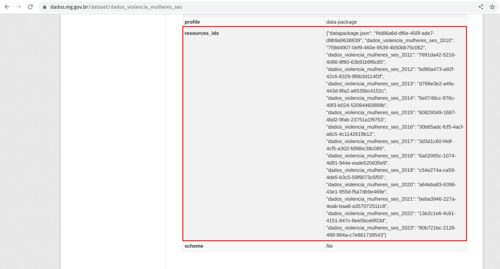

# Atualização de conjunto de dados após inclusão de novo recurso

O [dpckan](https://pypi.org/project/dpckan/0.1.21), até a versão 0.1.21, cria no conjunto publicado uma propriedade chamada `resource_id`.

<figure markdown>
  
<strong>Conjunto Violência contra Mulheres SES</strong>

  { align=center }
  <figcaption><a href="https://dados.mg.gov.br/dataset/dados_violencia_mulheres_ses?activity_id=cf763700-6c7f-4532-8b4d-8f0009c0e493">Versão em 11/07/2023</a></figcaption>
</figure>

Estes `ids` registrados durante a criação do conjunto (`dpckan dataset create`), são utilizados durante o processo de atualização.
Neste sentido, caso um novo recurso seja adicionado a um dataset já publicado e o comando `dpckan dataset update` (e suas variações) for utilizado, **nada acontecerá com este novo recurso**.
Para que o mesmo passe a ser atualizado, é necessário realizar sua inclusão manual via `dpckan resource <resource-name> create` (variações são aceitas, como a utilização da flag `--datastore`).

Um problema bastante comum para quem utiliza esta versão do [dpckan](https://pypi.org/project/dpckan/0.1.21) é não conseguir atualizar o conjunto após a inclusão de um novo recurso. Um exemplo deste tipo de erro foi relatado [neste issue](https://github.com/thiagomrm/TesteCGE/issues/5).
Basicamente, um **recurso inicialmente criado no CKAN havia sido excluído localmente após algum tempo** (processo relativamente comum, pensando que o conjunto irá evoluir ao longo do tempo).
**Quando o comando `dpckan dataset update` não encontra algum recurso disponível na instância do CKAN localmente ele para a atualização e disponibiliza a mensagem `Error during https://dados.mg.gov.br/dataset/<dataset-name>`**. Para solucionar a questão basta [excluir referido `resource_id` manualmente na interface gráfica do CKAN](https://github.com/thiagomrm/TesteCGE/issues/5#:~:text=resource_id%20dados_violencia_geral_ses%3A-,Gerenciar%20conjunto,-%3A) e o comando `dpckan dataset update` (e suas variações) voltará a funcionar.

Em resumo, o [dpckan](https://pypi.org/project/dpckan/0.1.21), até a versão 0.1.21, espera que recursos locais sejam os mesmos disponíveis na instância do CKAN desejada. Caso haja alguma diferença a propriedade `resources_ids` deve ser editada manualmente na interface gráfica do CKAN, evitando assim erros de atualização.
